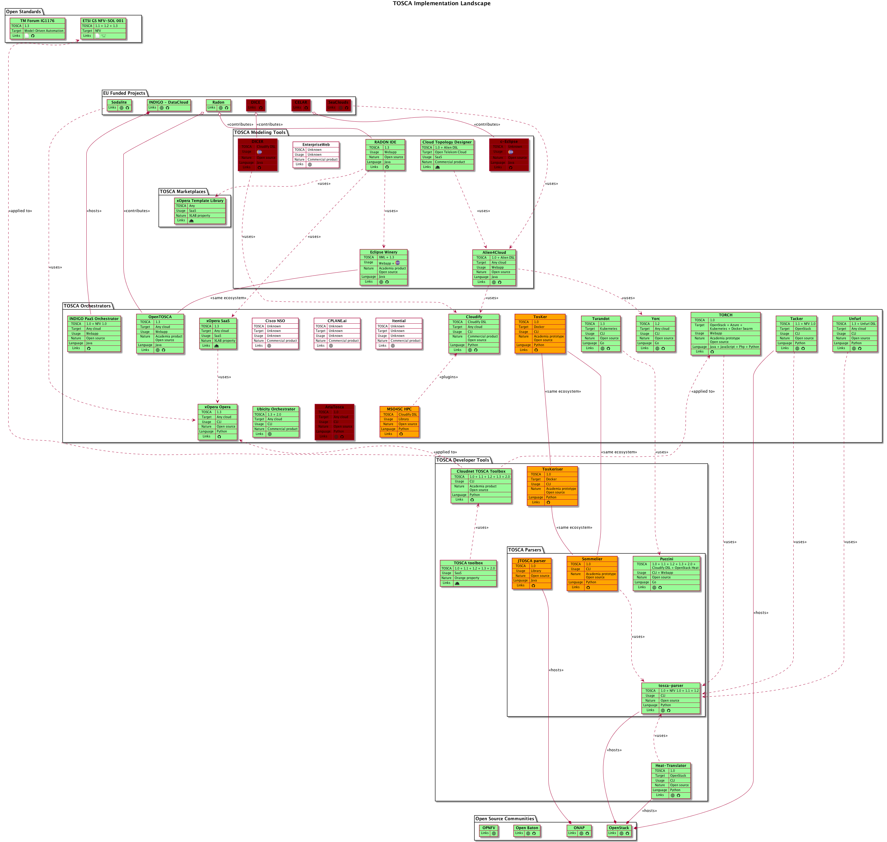

# TOSCA Implementation Landscape

The **TOSCA Implementation Landscape** is a visual representation of the list of [Known TOSCA Implementations](https://github.com/oasis-open/tosca-community-contributions/wiki/Known-TOSCA-Implementations) maintained by the OASIS TOSCA TC, see these [slides](https://www.oasis-open.org/committees/download.php/67709/TOSCA%20Webinar-2020-09-09.pdf) also.

## TOSCA Implementation Landscape

The **TOSCA Implementation Landscape** is depicted in the following big picture:



See also the [interactive version of the **TOSCA Implementation Landscape**](TOSCA-Implementation-Landscape.svg), i.e., SVG + hyperlinks.

## Applied Methodology

### Collecting the data set

TBC


### Generating the visual diagrams

[PlantUML](https://plantuml.com) is used to generate the visual **TOSCA Implementation Landscape** diagrams from the collected data set.

To (re)generate these diagrams, let's type:
```sh
$ ./generate_diagrams.sh
```

Let's note that following required software need to be pre-installed:
* [Java](https://www.java.com)
* [Graphviz](https://graphviz.org/)

## Contributions

Any contribution (e.g., adding a new TOSCA implementation, correcting any misinformation or adding new criteria) is welcome. Please, [create a new issue](https://github.com/philippemerle/tosca-implementation-landscape/issues/new) or pull request.
