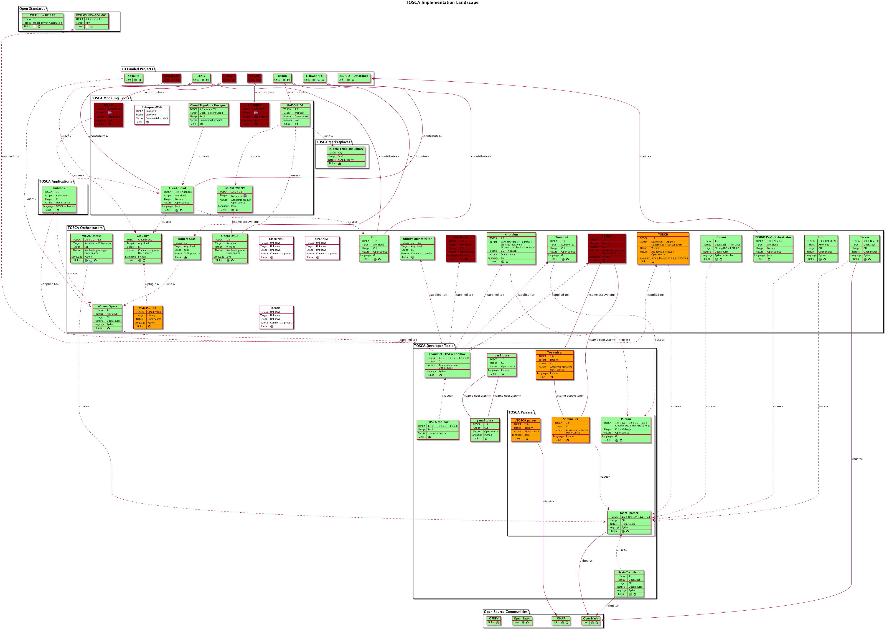

# TOSCA Implementation Landscape

The **TOSCA Implementation Landscape** is a visual representation of the list of [Known TOSCA Implementations](https://github.com/oasis-open/tosca-community-contributions/wiki/Known-TOSCA-Implementations) maintained by the OASIS TOSCA TC, see these [slides](https://www.oasis-open.org/committees/download.php/67709/TOSCA%20Webinar-2020-09-09.pdf) also.

## TOSCA Implementation Landscape

The **TOSCA Implementation Landscape** is depicted in the following big picture:



See also the [interactive version of the **TOSCA Implementation Landscape**](TOSCA-Implementation-Landscape.svg), i.e., SVG + hyperlinks.

## Applied Methodology

The most crucial methodological points in any study are objectivity and exhaustivity. I did my best. 

### Collecting the data set

I started from the list of [Known TOSCA Implementations](https://github.com/oasis-open/tosca-community-contributions/wiki/Known-TOSCA-Implementations) maintained by the OASIS TOSCA TC and reported in these [slides](https://www.oasis-open.org/committees/download.php/67709/TOSCA%20Webinar-2020-09-09.pdf). The entries in this list are sorted in the alphabetical order and are intrinsically heterogeneous.

In order to structure the TOSCA landscape, I gradually built a classification containing the following six categories:
1. **EU Funded Projects**: This groups European Union funded projects which have contributed to some TOSCA software tools. Examplary projects are **CELAR**, **Indigo**, **RADON**, **SeaClouds**, and **SODALITE**. I discovered the missing **DICE** later during the study.   
2. **TOSCA Modeling Tools**: This groups all TOSCA implementations providing a graphical interface (GUI) to design both TOSCA topology templates and types. Examplary implementations are **Alien4Cloud**, **Cloud Topology Designer**, **DICER**, **Eclipse Winery**, and **EnterpriseWeb**. I discovered the missing **DICE** and **RADON IDE** later during the study.
3. **TOSCA Marketplaces**: This groups TOSCA specific places where CSARs can be imported, stored, and then proposed to TOSCA end-users. I discovered this category during the study and found only one market place currently, i.e., **xOpera Template Library**. No doubt, other marketplaces could emerge in the future.
4. **TOSCA Orchestrators**: As the category name clearly indicates, this groups all TOSCA orchestrators which automate the deployment of TOSCA topology templates.  This category contains a lot of the entries of the initial list, and there are so many examplary orchestrators that I prefer to name none. But you should find your favorite orchestrator, shouldn't you?
5. **TOSCA Developer Tools**: This groups all other software to help the job of TOSCA developers, i.e. TOSCA parsers and TOSCA processors which are independent of any TOSCA orchestrator or modeling tool. Examplary tools are the well-known OpenStack **tosca-parser** and my amazing [**TOSCA toolbox**](https://github.com/Orange-OpenSource/Cloudnet-TOSCA-toolbox) (I am not really objective on the latter:wink:).
6. **Open Source Communities**: This groups large open source projects which host (or should host) TOSCA software tools and orchestrators. The examplary community is **OpenStack**.

TOSCA users should be mainly interested by the **TOSCA Modeling Tools**, **TOSCA Marketplaces**, **TOSCA Orchestrators**, and **TOSCA Developer Tools**. Following figure is depicted how these pieces of software interact:


The next step was to select a set of criteria to characterize each TOSCA implementation. This set must be smallest to simplify the reading of this study but enough large to provide pertinent information to TOSCA users (you). The currently selected six criteria are the following:
* **Activity**: This is the level of activities of a TOSCA implementation.  The two only levels are:
  * **Active**: By default, all TOSCA implementations are tagged as active and are represented by green maps. 
  * **Inactive**: An implementation is tagged as inactive and are represented by a red map if it was retired, completed, or had no commits since several years. **CELAR**, **DICE** and **SeaClouds** EU projects are completed since several years ago. **AriaTosca** orchestrator was retired on 2018. There are no commits on **c-Eclipse** and **DICER** since 2015 and 2018 respectively.
* **TOSCA**: These are the TOSCA profile(s), i.e., `tosca_definitions_version` keyname, supported by the TOSCA implementation. For some implementations, this information was not found, so it is unknown. This is the case for **c-Eclipse**, **Cisco NSO**, **CPLANE.ai**, **EntrepriseWeb**, and **Itential** products. Some products added their proprietary profiles such as **Alien4Cloud** and **Unfurl**. Let's note that **Cloudify** only supports its own profiles.
* **Target**: This is the target environment(s) where deployments can be done with the TOSCA implementation.
* **Usage**: This determinates how the end-user interacts with the TOSCA implementation, via a
  * **CLI**: Command-Line Interface (CLI).
  * **Webapp**: A web application deployed on the end-user environment.
  * **SaaS**: A Software-as-Service (SaaS) already deployed by a provider.
* **Nature**: The implementation is **Open source** and/or a **Commercial product**.
* **Language**: Only for open source implementations, this indicates the programming language(s) used to develop the open source product.
* **Links**: This takes the following values:
  * ****: This link points to the address of the official Web site of the TOSCA implementation.
  * ****: This link points to the GitHub repository hosting the open source code for the TOSCA implementation.
  * ****: This link points to the address where the Software-as-Service is deployed.


TBC

Five categories of relationships between TOSCA implementations represented by arrows tagged with:
* **`<<contributes>>`**: An EU funded project contributes to a TOSCA software tool.
* **`<<uses>>`**: A source entry uses another target entry.
* **`<<plugins>>`**: A source implementation is a plugin of another target implementation.
* **`<<hosts>>`**: An open source community hosts a TOSCA implementation.
* **`<<applied to all examples>>`**: Cloudnet TOSCA toolbox was applied to all examples provided by a target TOSCA implementation.

TBC
 
### Generating the visual diagrams

[PlantUML](https://plantuml.com) is used to generate the visual **TOSCA Implementation Landscape** diagrams from the collected data set.

To (re)generate these diagrams, let's type:
```sh
$ ./generate_diagrams.sh
```

Let's note that following required software need to be pre-installed:
* [Java](https://www.java.com)
* [Graphviz](https://graphviz.org/)

## Contributions

Any contribution (e.g., adding a new TOSCA implementation, correcting any misinformation or adding new criteria) is welcome. Please, [create a new issue](https://github.com/philippemerle/tosca-implementation-landscape/issues/new) or pull request.
